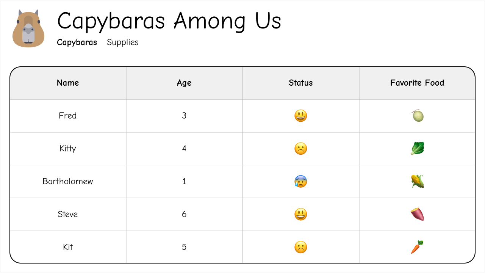

# Style Capybaras Page as Home Page

## Description

Turns out the non-profit is not a fan of having a home page with just two links. The solution now is to take a more traditional approach by having the home page be the capybaras page with a header nav. You will also implement the design below:

\* _the logo can be found in the repo as `public/logo.svg`_

## Success Criteria

- Visiting `/capybaras` will result in a 404
- Visiting `/` will show the Capybaras page
